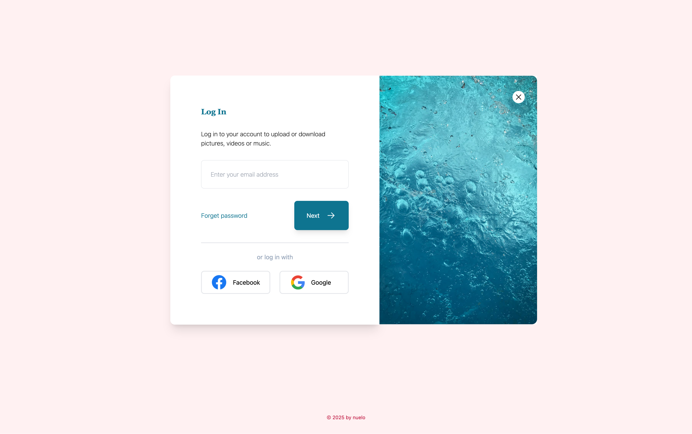

# Login Modal

This is a simple login modal built as part of my journey to master Tailwind CSS. The project showcases a clean, responsive modal with a login form, demonstrating utility-first CSS and modern web design techniques.

## Overview

The Login Modal is an HTML and CSS-only project (with optional JavaScript for interactivity) designed to practice UI and responsive design skills. It features a centered modal with a login form, including input fields for email and password, a submit button, and a close button. This implementation uses Tailwind CSS to create a sleek, user-friendly interface.

## Features

- Responsive Design: Fully responsive modal using Tailwind’s default and md:  prefixes, ensuring compatibility across mobile, tablet, and desktop.

- Utility-First Styling: Leverages Tailwind CSS for rapid development with classes like flex, grid, bg-opacity, and rounded-lg.

- Interactive Elements: Hover effects on buttons and links using Tailwind’s hover: utilities, with optional JavaScript for opening/closing the modal.

- Form Styling: Clean, accessible form inputs with Tailwind’s focus: utilities for enhanced user experience.

## Live Demo

View [Live](https://login-modal-swart.vercel.app/)

## Screenshot

- Desktop View

- Mobile View 

## Acknowledgement

- Traversy Media’s [Tailwind-course-project](https://github.com/bradtraversy/tailwind-course-projects)
- Tailwind CSS [documentation](https://tailwindcss.com/)

